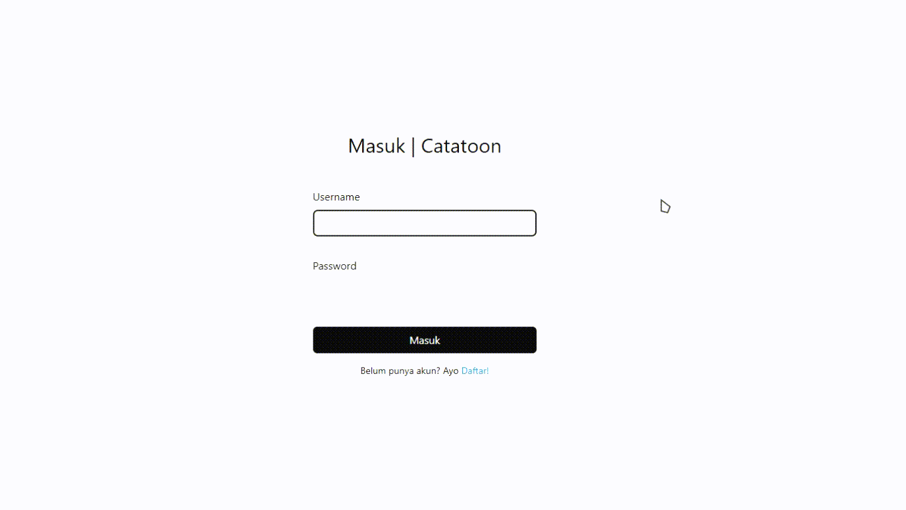

# Catatoon

**Catatoon** is a dynamic note-taking web application that helps users create, edit, and manage their personal notes easily.  
Built with simplicity and productivity in mind, Catatoon brings a clean UI and responsive design for all devices.

---

## Features
- User authentication (login & registration)
- Role-based access system (Admin & User)
- Create, edit, delete, and view notes
- Date-based note tracking
- Dashboard with daily note statistics
- Fully responsive design

---

## Tech Stack
- **Frontend:** HTML, CSS (TailwindCSS), JavaScript  
- **Backend:** PHP  
- **Database:** MySQL  

---

## Preview
Here’s a sneak peek of **Catatoon**!  

---

## About the Project
Catatoon was developed as a personal project to explore dynamic web development concepts — combining front-end and back-end logic for a smooth note management experience.

---

## Author
**Elang Alamsyah Habibi** — Student at SMKN 1 Pemalang, Software & Game Development major.  
Passionate about web development, design, and tech creativity.  

📷 Instagram: [@elanghabibi](https://instagram.com/elanghabibi)

---

## License
**License by Elang © 2025**

This project is licensed under the **Catatoon Personal License**.  
You are free to:
- View, learn, and explore the code for educational purposes.
- Use parts of the project **with proper credit** to the author.

You are **not allowed to:**
- Re-upload or redistribute this project as your own.
- Use this project for commercial purposes without permission.

For any collaboration or permission requests, contact me via [Instagram @elanghabibi](https://instagram.com/elanghabibi).

---

*Thank You*
